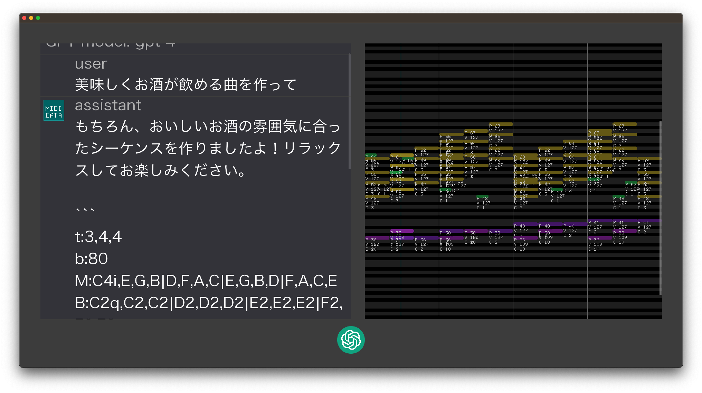
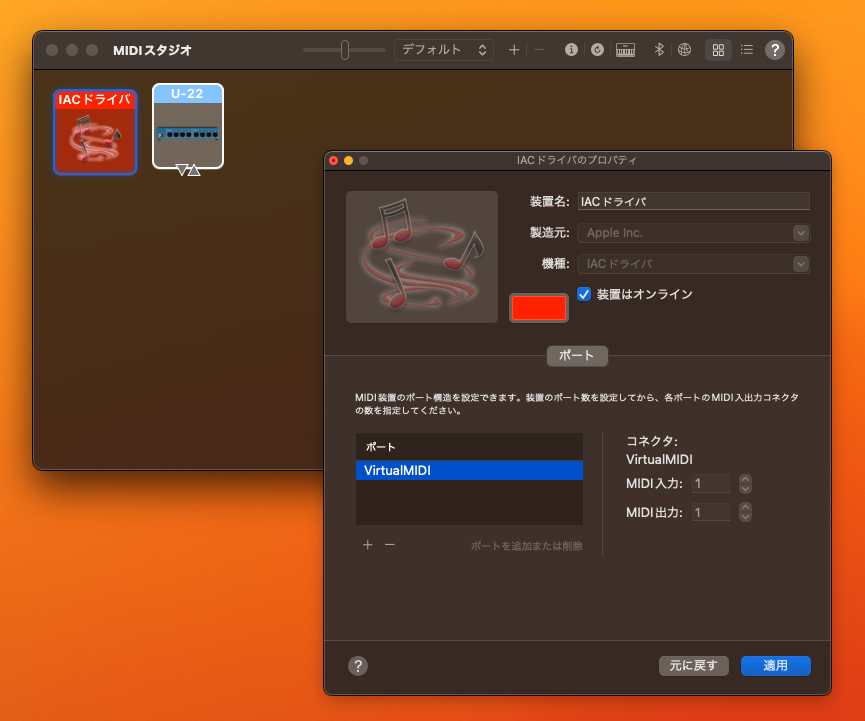

# MIDI Chat の使い方

このソフトは、ChatGPTで会話してMIDIのシーケンスを出力するソフトです。

あくまでも仮想MIDIに対してMIDI信号を送るソフトなので単体では音は出力されません。DAWなどで信号を受け取ってもらうことで初めてシーケンスが音声として再生されます。

最初に使うときは、後述するMIDIデバイスの設定方法も参照してください。

Windowsでビルドすれば動作しますが、以下の説明はMac用に書いています。

# 操作方法

左半分はチャットの履歴で、右半分が現在のシーケンスです。
どちらも縦スクロールできます。
中央のボタンはステータスを表示しています。

## ステータス一覧

グレーの時は録音可能な状態です。

このボタンをクリックするか、スペースキーで録音開始されます。

録音中です。

このボタンをクリックするか、スペースキーで録音を停止します。

停止すると Whisper によるテキスト変換ステータスになります。

音声をテキストに変換中です。

変換後はすぐにChatGPTにプロンプトが送信されるので、次のステータスに自動的に移行します。

ChatGPTの返答待ちです。

GPT-4を使用している場合は特に時間がかかることがあります。早くて30秒、遅い場合は1-2分かかります。

あまりに長い時は、3分を上限として Timeout 扱いとなり、自動的に Regenerate (プロンプトの再送信) が発生します。

## 音声入力デバイス

マイク入力は、デフォルトの入力デバイスが選択されます。

音声が正しく読み取れない場合は、異なるデバイスがデフォルト設定されていないか確認してください。変更した場合は、アプリを再起動するとそのデバイスが選択されます。

## MIDIデバイスの設定方法

このプログラムは、仮想MIDIポートを探してそれに対してGeneralMIDI規格に則ったMIDI信号を送ります。

"VirtualMIDI" という名前の仮想MIDIポートを作るとそこに送信されるので、MacのオーディオMIDI設定でポートを開いてください。

DAWがない環境で簡易的に音を鳴らす場合は、Mini Keys などを使うと便利です。

[Mini Keys](https://apps.apple.com/jp/app/mini-keys/id1611734597?mt=12)

Windowsの場合は、loopMIDIなどを使って仮想MIDIポートを作ってください。

